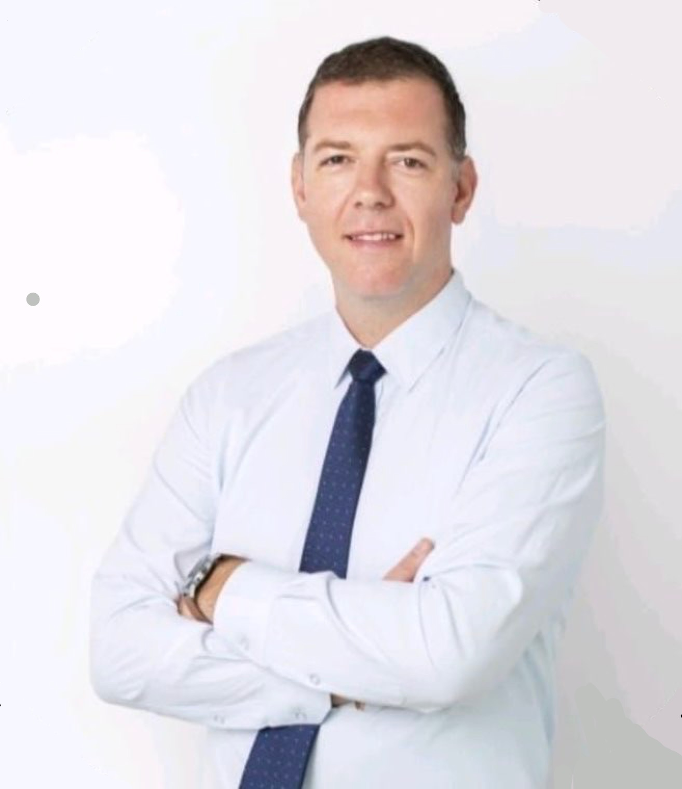

+++
title = " Interview "
date = "2024-04-22"
draft = false
pinned = false
+++
***Sind Sie viel Umgezogen in ihrem Leben? Haben Sie verschiedene Kontinente ihre Heimat genannt? Marijan Sudic kann genau dies behaupten.***

Marijan Sudic ist 1982 in Zagreb geboren und hat seine ersten neun Lebensjahre in Bosnien verbracht, danach verbrachte er vier Jahre in Kroatien. Bevor seine Familie sich entschied, drei Jahre in Neu Zealand zu verbringen, um dann endgültig in Australien zu leben, war Marijan noch ein Jahr in England. Marijan war bis 2017 in Australien, bis er sich entschied zurück nach Kroatien zu kehren, dort befindet er sich momentan. 

**Um anzufangen, wieso sind sie so viel Umgezogen?** Nach dem Krieg im damaligen Jugoslawien, Zwischen 91 und 94, sind wir nach London gezogen, um Englisch zu lernen, da ich und meine Familie kein Englisch konnte. Damals war ich 12 

Danach sind wir nach Neuseeland. Mein Vater bekam dort eine dauerhafte Aufenthaltsgenehmigung.

**Glauben Sie ihr Leben hätte ohne den Krieg anders ausgeschaut?** Der Krieg hat einen Einfluss gehabt, mein Leben hätte definitiv anders ausgesehen. Ich kann mich daran erinnern, dass es schon vor Kriegsbeginn Gespräche über einen Umzug nach Südafrika gab. Wir haben sowieso darüber nachgedacht. Desto mehr ich darüber nachdenke, bevorzuge ich die Art und Weise wie mein Leben bisher aussieht, anstatt was hätte sein können ohne den Krieg. 

*« Das Leben ist eine Reise und alles, was man im Leben lernt, kommt von verschieden Menschen, verschieden Orten und verschieden Kulturen.» -Marijan Sudic*

**War es schwer ich verschieden Lebenssituationen Anzupassen?** Ich meine, wir werden uns immer Anpassen, Es ist nicht schwer sich anzupassen, es ist einfach Teil des Menschseins. Man begibt sich in eine Situation und hält sie im Grunde mit den Händen fest und sagt: Seht her, das ist es, was ich tun muss. Als ich zum Beispiel ins Vereinigte Königreich zog, konnte ich kein englisch sprechen. Als ich dort war, wusste ich nicht, was ich tun sollte, soll ich einfach den Mund halten und nicht sagen oder soll ich wirklich versuchen, zu lernen und zu lernen? Und ja, genau da sind wir jetzt. 

**Glauben sie, sie würden das Leben anders sehen, wenn du nicht so viel gereist wärst?** 

Wahrscheinlich schon. Das liegt wahrscheinlich and den verschiedenen Kulturen, die ich kennengelernt habe, und an den unterschiedlichen Lebensstilen, die ich von Menschen in verschiedenen Teilen der Welt mitbekommen habe. Ich würde auf jeden Fall jedem empfehlen zu reisen, der die Möglichkeit dazu hat, denn es öffnet den Horizont und die Sichtweise.  

**Könnten Sie den Begriff ‘Zuhause’ für mich definieren?** Es ist dort, wo man sich zugehörig fühlt. Durch die Familie und durch, ich würde nicht sagen das Freunde einen definieren, aber in gewisser Weise, wenn man Freunde hat, die man als Teil der Familie betrachtet, dann ja, verändert sich das den Begriff Heimat. Ich habe eine sehr nette und gute Gruppe von Freunden in Australien und das ist der Grund, wieso ich sagen würde, dass Australien mein Zuhause ist. Aber gleichzeitig ist meine Familie derzeit in Kroatien, also meine engste Familie, meine Frau und meine Tochter. 

Meine Eltern und meine Schwester leben in Australien, deswegen ist es für mich ‘halb-halb’. 

**Hat sich der Begriff ‘Heimat?, also die Bedeutung, im Laufe der Jahre für Sie verändert?** Ich denke, das ist eine spannende Frage, denn wenn man so viel reist, wenn man an einen Ort geht und denkt: «Na gut, jetzt muss ich mich hier niederlassen.» und man versucht sein Stück Heimat zu finden, wo immer man ist. Also, ja es ändert sich schon ein bisschen, ja. 

**Wären Sie gerne nur an einem Ort geblieben?** Nein, ich denke, wenn man an einem Ort festsitzt, nun ja, für mich persönlich ist es keine Zeitverschwendung, aber man ist nicht offen dafür was andere Menschen und andere Kulturen zu bieten haben. Ich meien, ich reise viel nach China, und wenn ich sehe, wie die Leute dort sind, dann ist das wirklich einladend. Es ist wirklich schön. 

**Sehen sie einen untershied zwiscen den Menschen an verschiedenen Orten?** Wie ich schon sagte, es ist eine andere Kultur. Man muss jeder Klutur eine Chance geben. Ich fahre ziemlich oft nach Grossbritannien und ich würde niemanden aus Grossbritannien beleidigen. Aber fühle mich unter den Menschen in Australien wohler als in Grossbritannien.

**Als abschliessende Frage. Hätten Sie etwas anders gemacht, wenn Sie die Wahl gehabt hätten, würden sie etwas ändern?** Nein. Ich denke, ja, um auf die vorherige Frage zurückzukommen, ich denke, alles geschieht aus einem Bestimmten Grund. Die Umzüge, die ich machen musste, die Tatsache, dass ich Englisch lernen musste, Die Tatsache, dass ich in einen Grossteil meiner Zeit in Australien verbracht habe, hat mir neue Horizonte eröffnet und mir viel mehr Möglichkeiten gegeben, verglichen mit dem was passiert wäre, wenn ich in Kroatien geblieben wäre. Ich hätte wahrscheinlich immer noch einen Weg gefunden mich und meine Familie glücklich zu machen. 

Aber ja, alles geschieht aus einem bestimmten Grund, also ich würde nichts ändern.